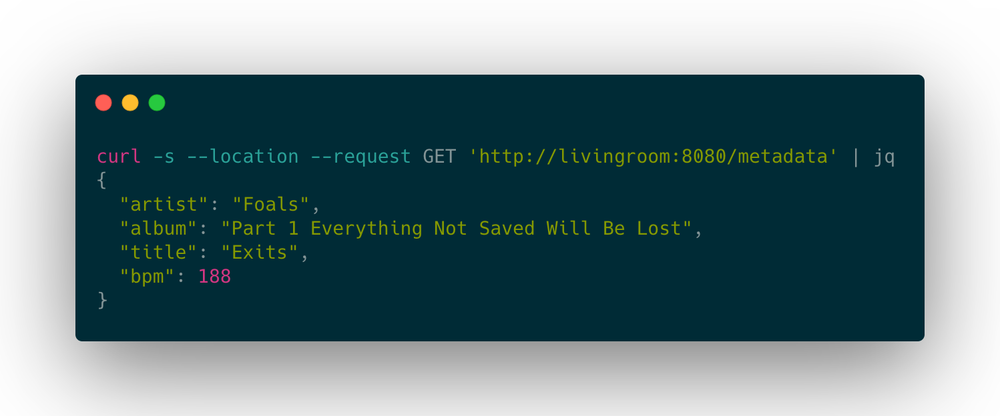

# shairport-sync-metadata-reader

A Spring Boot application which serves a REST API for the metadata produced by [shairport-sync](https://github.com/mikebrady/shairport-sync).



It also:

* Looks up the beats-per-minute value for the playing track using [songbpm.com](https://songbpm.com/) and includes this in the API response.
* Sends the BPM value, once received, to a target REST endpoint. I'm using this in conjunction with my [traffic light project](https://github.com/skhg/traffic-light-controller). 

The metadata reading component is based on the C code in the [upstream repo](https://github.com/mikebrady/shairport-sync-metadata-reader), the rest of it is customised for my own needs.

## Dependencies
The shairport-sync server needs to have been built with the flag `--with-metadata` so that the reader will have some content to consume. Refer to the section https://github.com/mikebrady/shairport-sync/blob/master/INSTALL.md#build-and-install for an example, but including the extra parameter.
  
## Build & Install
Clone this repo and build using `mvn clean install`. Run the executable `.jar` file in the `/target` subdirectory.

I installed the Spring Boot application as an `init.d` service (see [this guide](https://docs.spring.io/spring-boot/docs/current/reference/html/deployment.html#deployment-initd-service)) which makes it easy to start, stop and gather logs.

I'm using GitHub Actions and the [master-branch](./.github/workflows/master-branch.yml) workflow to automatically version the build products, and deploy this to my local device.

## Configuration
Set the environment variable `SPRING_PROFILES_ACTIVE=production` to use songbpm.com rather than the default dummy lookup.

See [application.properties](./src/main/resources/application.properties) for sample configuration. If you also have a funny traffic light in your home, and want to use it, you will need to customise the `visualiser.baseurl` parameter. 

## API
When the application runs, API docs are served by [springdoc-openapi](https://springdoc.org/) at `/docs`. These are fully interactive so you can explore and test out the API as it runs.

Separately, data is sent to the visualiser using a JSON blob of the form

```json
{
  "bpm" : 123
}
```
